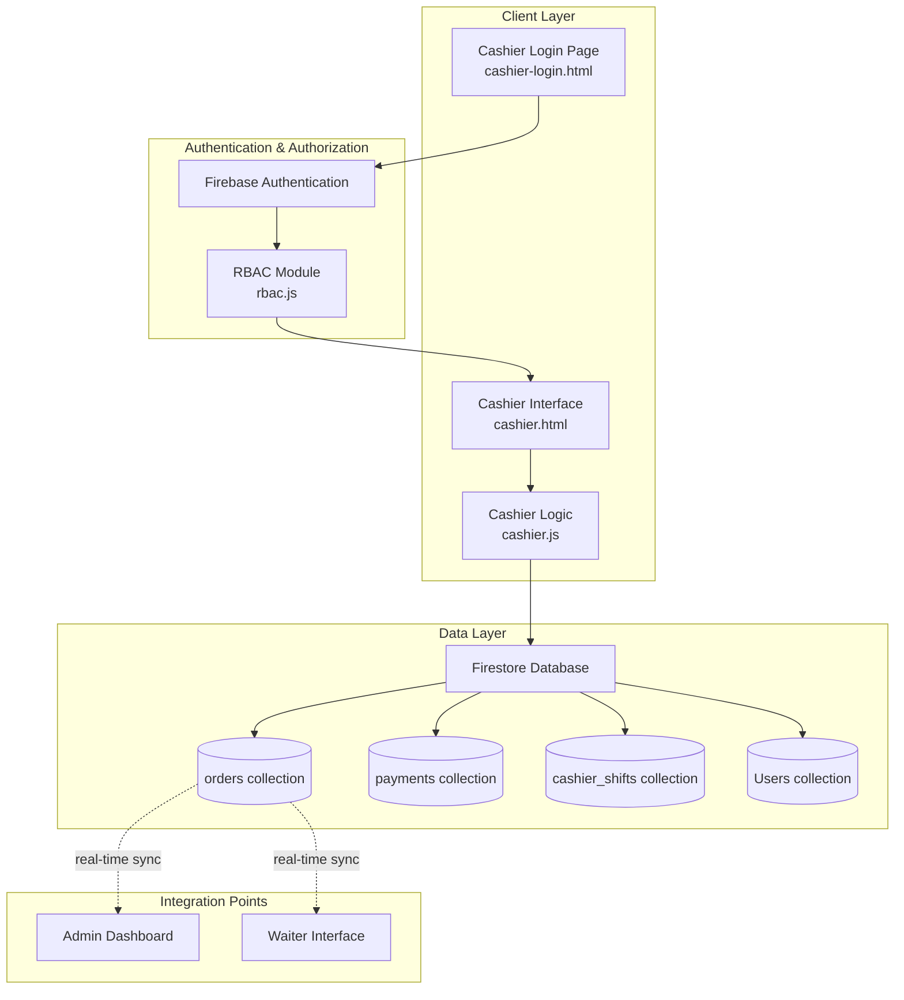

# Design Document: Cashier Payment Interface

## Overview

The Cashier Payment Interface is a dedicated web-based portal for restaurant cashiers to process customer payments, generate receipts, and manage cash drawer operations. This interface extends the existing Salo sa Antipolo restaurant management system by adding a focused payment processing view separate from the admin dashboard.

### Design Goals

1. **Focused Workflow**: Provide cashiers with a streamlined interface dedicated solely to payment processing without administrative distractions
2. **Real-time Synchronization**: Ensure order status updates are reflected instantly across all interfaces (cashier, admin, waiter)
3. **Accurate Financial Tracking**: Maintain precise records of all transactions with payment method tracking and cash drawer reconciliation
4. **User Experience Consistency**: Match the visual design and interaction patterns of existing admin and waiter interfaces
5. **Operational Integrity**: Prevent duplicate payments, validate all inputs, and ensure data consistency

### Key Features

- Dedicated cashier authentication and role-based access
- Real-time order list filtered for payment-ready orders
- Multi-payment method support (Cash, Credit Card, Debit Card, GCash, PayMaya)
- Split payment processing for shared bills
- Automated receipt generation with VAT and service charge calculation
- Payment history tracking per shift
- Cash drawer management with reconciliation reporting
- Integration with existing Firestore database and authentication system


## Architecture

### System Architecture

The cashier interface follows a client-side web application architecture consistent with existing interfaces:



### Technology Stack

- **Frontend**: Vanilla JavaScript (ES6 modules), HTML5, CSS3
- **Database**: Firebase Firestore (NoSQL document database)
- **Authentication**: Firebase Authentication
- **Real-time Updates**: Firestore onSnapshot listeners
- **Module Pattern**: ES6 imports/exports
- **Styling**: CSS custom properties with light/dark theme support

### Integration with Existing System

The cashier interface integrates with:

1. **RBAC Module** (`rbac.js`): Extends role definitions to include `cashier` role with specific permissions
2. **Firebase Configuration**: Reuses existing Firebase app configuration
3. **Firestore Collections**: Reads from `orders` collection, writes to new `payments` and `cashier_shifts` collections
4. **Authentication Flow**: Follows same pattern as admin and waiter login
5. **UI Theming**: Uses shared CSS variables and design tokens for consistency


## Components and Interfaces

### 1. Cashier Login Component

**Files**: `cashier-login.html`, `cashier-login.css`, `cashier-login.js`

**Purpose**: Authenticate cashiers and redirect to the cashier interface

**Key Features**:
- Email/password authentication using Firebase Auth
- Input validation and error messaging
- Session persistence with `browserLocalPersistence`
- Auto-redirect if already authenticated as cashier
- Visual consistency with admin/waiter login pages

**Interface**:
```javascript
// cashier-login.js exports
async function authenticateCashier(email: string, password: string): Promise<void>
function showError(message: string): void
function showToast(message: string): void
```


### 2. Order List Component

**Purpose**: Display all orders ready for payment with real-time updates

**Key Features**:
- Firestore real-time listener on `orders` collection
- Filter orders with status `served` or `ready_for_payment`
- Exclude orders already marked as `paid`
- Search functionality by table number or order ID
- Display order metadata (ID, table, total, timestamp)

**Interface**:
```javascript
function renderOrderList(orders: Order[]): void
function filterOrders(orders: Order[], searchTerm: string): Order[]
function selectOrder(orderId: string): void
function subscribeToOrders(callback: (orders: Order[]) => void): Unsubscribe

interface Order {
  id: string
  tableNumber: number
  total: number
  status: 'pending' | 'preparing' | 'served' | 'ready_for_payment' | 'paid'
  items: OrderItem[]
  waiterName: string
  createdAt: Timestamp
  notes?: string
}

interface OrderItem {
  name: string
  qty: number
  price: number
}
```


### 3. Payment Processor Component

**Purpose**: Handle payment transactions for single and split payments

**Key Features**:
- Support multiple payment methods
- Validate payment amounts against order totals
- Calculate change for cash payments
- Handle partial payments for split bills
- Prevent duplicate payments with optimistic locking
- Record transaction metadata (cashier ID, timestamp, payment method)

**Interface**:
```javascript
async function processPayment(payment: Payment): Promise<PaymentResult>
async function processSplitPayment(orderId: string, payments: PartialPayment[]): Promise<PaymentResult>
function validatePaymentAmount(amount: number, orderTotal: number): ValidationResult
function calculateChange(amountPaid: number, orderTotal: number): number

interface Payment {
  orderId: string
  paymentMethod: 'Cash' | 'Credit Card' | 'Debit Card' | 'GCash' | 'PayMaya'
  amount: number
  cashierId: string
  timestamp: Timestamp
}

interface PartialPayment {
  paymentMethod: string
  amount: number
}

interface PaymentResult {
  success: boolean
  transactionId?: string
  error?: string
}

interface ValidationResult {
  isValid: boolean
  error?: string
}
```


### 4. Receipt Generator Component

**Purpose**: Generate formatted receipts for printing

**Key Features**:
- Calculate VAT (12%) and service charge (7%) from order total
- Format receipt data for standard thermal printers
- Include all required receipt information
- Support reprinting for past orders
- Generate unique transaction reference numbers

**Interface**:
```javascript
function generateReceipt(order: Order, payments: Payment[]): Receipt
function printReceipt(receipt: Receipt): void
function calculateReceiptTotals(orderTotal: number): ReceiptTotals

interface Receipt {
  transactionRef: string
  restaurantName: string
  restaurantAddress: string
  orderId: string
  tableNumber: number
  items: OrderItem[]
  totals: ReceiptTotals
  payments: PaymentInfo[]
  timestamp: string
  waiterName: string
}

interface ReceiptTotals {
  subtotal: number        // VAT-exclusive amount
  vat: number             // 12% of subtotal
  serviceCharge: number   // 7% of (subtotal + VAT)
  grandTotal: number      // subtotal + VAT + serviceCharge
}

interface PaymentInfo {
  method: string
  amount: number
  change?: number
}
```


### 5. Cash Drawer Manager Component

**Purpose**: Track cash drawer operations and generate reconciliation reports

**Key Features**:
- Record starting cash amount on shift start
- Track all cash payments during shift
- Calculate expected cash balance
- Prompt for actual count on shift end
- Generate variance reports
- Support cash adjustments with reason codes

**Interface**:
```javascript
async function startShift(cashierId: string, startingAmount: number): Promise<string>
async function recordCashPayment(shiftId: string, amount: number, orderId: string): Promise<void>
async function endShift(shiftId: string, actualCount: number): Promise<ShiftSummary>
async function recordAdjustment(shiftId: string, amount: number, reason: string): Promise<void>

interface ShiftSummary {
  shiftId: string
  cashierId: string
  cashierName: string
  startTime: Timestamp
  endTime: Timestamp
  startingAmount: number
  cashPaymentsTotal: number
  adjustments: Adjustment[]
  expectedTotal: number
  actualCount: number
  variance: number
  transactionCount: number
}

interface Adjustment {
  amount: number
  reason: string
  timestamp: Timestamp
}
```


### 6. Payment History Component

**Purpose**: Display payment transaction history for the current shift

**Key Features**:
- Show all payments processed in current shift
- Filter by payment method
- Search by order ID or table number
- Display running total of collected payments
- Support navigation to receipt view

**Interface**:
```javascript
function renderPaymentHistory(payments: PaymentRecord[]): void
function filterByPaymentMethod(payments: PaymentRecord[], method: string): PaymentRecord[]
function searchPayments(payments: PaymentRecord[], term: string): PaymentRecord[]
function calculateShiftTotal(payments: PaymentRecord[]): number

interface PaymentRecord {
  id: string
  orderId: string
  tableNumber: number
  paymentMethod: string
  amount: number
  timestamp: Timestamp
  cashierId: string
}
```


## Data Models

### Firestore Collections

#### `orders` Collection (existing, extended)

```typescript
{
  id: string                    // Auto-generated document ID
  tableNumber: number
  status: 'pending' | 'preparing' | 'served' | 'ready_for_payment' | 'paid'
  items: OrderItem[]
  total: number                 // Base order total (before VAT and service charge)
  waiterName: string
  waiterId: string
  createdAt: Timestamp
  updatedAt: Timestamp
  notes?: string
  // New fields for payment tracking
  paidAt?: Timestamp
  paidBy?: string              // Cashier ID who processed payment
  paymentStatus?: 'unpaid' | 'partial' | 'paid'
}
```

#### `payments` Collection (new)

```typescript
{
  id: string                    // Auto-generated document ID
  orderId: string               // Reference to order
  transactionRef: string        // Unique transaction reference (e.g., "TXN-20250102-001")
  paymentMethod: 'Cash' | 'Credit Card' | 'Debit Card' | 'GCash' | 'PayMaya'
  amount: number
  change?: number               // For cash payments
  cashierId: string
  cashierName: string
  shiftId: string               // Reference to cashier_shifts
  timestamp: Timestamp
  
  // Split payment support
  isSplitPayment: boolean
  splitPaymentGroup?: string    // Group ID for related split payments
  
  // Receipt totals (cached for reporting)
  orderTotal: number
  vat: number
  serviceCharge: number
  grandTotal: number
}
```


#### `cashier_shifts` Collection (new)

```typescript
{
  id: string                    // Auto-generated document ID
  cashierId: string
  cashierName: string
  startTime: Timestamp
  endTime?: Timestamp
  
  // Cash drawer tracking
  startingAmount: number
  cashPayments: number          // Running total of cash payments
  adjustments: Adjustment[]
  expectedTotal: number         // startingAmount + cashPayments + sum(adjustments)
  actualCount?: number          // Entered at shift end
  variance?: number             // actualCount - expectedTotal
  
  // Transaction summary
  transactionCount: number
  totalCollected: number        // All payment methods combined
  
  // Payment method breakdown
  cashTotal: number
  creditCardTotal: number
  debitCardTotal: number
  gcashTotal: number
  paymayaTotal: number
  
  status: 'active' | 'closed'
}

interface Adjustment {
  amount: number                // Positive or negative
  reason: string
  timestamp: Timestamp
  recordedBy: string           // Cashier ID
}
```


#### `Users` Collection (existing, extended)

```typescript
{
  uid: string                   // Firebase Auth UID
  email: string
  name: string
  role: 'admin_manager' | 'admin_owner' | 'admin_cashier' | 'cashier' | 'waiter'
  createdAt: Timestamp
  // New fields for cashier role
  cashierCode?: string          // Optional unique cashier identifier
  activeShiftId?: string        // Reference to current active shift
}
```

### Financial Calculation Model

The system uses a consistent financial calculation model across all receipts and reports:

```typescript
// Input: Base order total (items sum)
orderTotal = sum(item.price * item.qty for each item)

// Step 1: Calculate VAT-exclusive amount (reverse VAT calculation)
// Philippine VAT is 12%, so order total is VAT-inclusive
vatExclusiveAmount = orderTotal / 1.12

// Step 2: Extract VAT amount
vatAmount = orderTotal - vatExclusiveAmount

// Step 3: Calculate service charge (7% of VAT-inclusive total)
serviceCharge = orderTotal * 0.07

// Step 4: Calculate grand total
grandTotal = orderTotal + serviceCharge

// Summary:
// - orderTotal: VAT-inclusive base amount
// - vatExclusiveAmount: Amount before VAT
// - vatAmount: 12% VAT
// - serviceCharge: 7% service charge
// - grandTotal: Final amount customer pays
```


## Correctness Properties

*A property is a characteristic or behavior that should hold true across all valid executions of a system—essentially, a formal statement about what the system should do. Properties serve as the bridge between human-readable specifications and machine-verifiable correctness guarantees.*

### Property Reflection

After analyzing all acceptance criteria, I identified the following properties for testing. During reflection, I consolidated several related properties:

- **Order Filtering (2.1, 2.6)**: Combined into single property about filtering orders by status
- **Order Display Fields (2.2, 2.4, 7.1, 7.4, 7.5)**: Combined into comprehensive order display property
- **Payment Validation (3.3, 3.7, 8.2)**: Combined into comprehensive payment validation property
- **Payment Recording (3.5, 3.6)**: Combined into single property about payment persistence and status update
- **Receipt Fields (4.2, 4.6)**: Combined into comprehensive receipt content property
- **Split Payment Tracking (6.2, 6.5)**: Combined into property about split payment data integrity
- **Cash Drawer Calculation (10.2, 10.3, 10.4)**: Combined into cash tracking and reconciliation property


### Property 1: Authentication Result Validity

*For any* set of credentials, authentication should either succeed and grant cashier access, or fail and display an error message without granting access.

**Validates: Requirements 1.2, 1.3**

### Property 2: Payment-Ready Order Filtering

*For any* collection of orders with various statuses, the displayed order list should contain only orders with status "served" or "ready_for_payment", and should exclude orders with status "paid".

**Validates: Requirements 2.1, 2.6**

### Property 3: Order Display Completeness

*For any* order selected for payment, the displayed order details should include order ID, table number, all items with names/quantities/prices, order total, waiter name, and timestamp.

**Validates: Requirements 2.2, 2.4, 7.1, 7.4, 7.5**

### Property 4: Order Search Accuracy

*For any* order in the system, searching by its order ID or table number should return that order in the search results.

**Validates: Requirements 2.5, 5.6**

### Property 5: Payment Amount Validation

*For any* payment submission, if the payment amount is less than or equal to zero, OR is non-numeric, OR is less than the order total, then the payment should be rejected with an error message.

**Validates: Requirements 3.3, 3.7, 8.2**


### Property 6: Change Calculation Accuracy

*For any* cash payment where the amount paid equals or exceeds the order total, the calculated change should equal the amount paid minus the order total.

**Validates: Requirements 3.4**

### Property 7: Payment Persistence and Status Update

*For any* confirmed payment, a payment record should be created in the database containing payment method, amount, timestamp, and cashier ID, AND the corresponding order's status should be updated to "paid".

**Validates: Requirements 3.5, 3.6**

### Property 8: Receipt Generation Completeness

*For any* completed payment, the generated receipt should include restaurant name, address, order ID, table number, all order items with prices, VAT-exclusive amount, VAT amount (12%), service charge (7%), grand total, payment method(s), amount paid, change (if applicable), timestamp, and a unique transaction reference number.

**Validates: Requirements 4.1, 4.2, 4.6**

### Property 9: Receipt Reprint Idempotency

*For any* previously paid order, reprinting the receipt should generate a receipt with identical transaction details as the original receipt.

**Validates: Requirements 4.5**


### Property 10: Shift Payment History Filtering

*For any* active cashier shift, the payment history display should only include payments processed during that specific shift.

**Validates: Requirements 5.1**

### Property 11: Payment History Display Completeness

*For any* payment record in the shift history, the displayed information should include order ID, table number, payment amount, payment method, and timestamp.

**Validates: Requirements 5.2**

### Property 12: Shift Total Calculation

*For any* set of payments in a shift, the displayed shift total should equal the sum of all payment amounts.

**Validates: Requirements 5.3**

### Property 13: Shift Summary Generation

*For any* cashier logout event, a shift summary report should be generated containing shift ID, cashier info, start/end times, total transactions, and total amount collected.

**Validates: Requirements 5.4**

### Property 14: Payment Method Filtering

*For any* payment method filter selection, the filtered payment history should contain only payments made with that specific payment method.

**Validates: Requirements 5.5**


### Property 15: Split Payment Tracking Integrity

*For any* split payment transaction, each partial payment should be recorded with its payment method and amount, and all partial payments should be associated with the same order.

**Validates: Requirements 6.2, 6.5**

### Property 16: Split Payment Remaining Balance

*For any* partial payment applied to an order, the displayed remaining balance should equal the order total minus the sum of all partial payments received so far.

**Validates: Requirements 6.3**

### Property 17: Split Payment Completion

*For any* order with split payments, when the sum of all partial payments equals or exceeds the order total, the order should be marked as "paid", and when the sum is less than the order total, the order should NOT be marked as "paid".

**Validates: Requirements 6.4, 6.6**

### Property 18: Order Notes Display

*For any* order that has special instructions or notes, those notes should be displayed in the order details view.

**Validates: Requirements 7.3**

### Property 19: Financial Calculation Consistency

*For any* order, the displayed subtotal (VAT-exclusive), VAT amount (12%), service charge (7%), and grand total should follow the calculation: subtotal = total / 1.12, vat = total - subtotal, serviceCharge = total * 0.07, grandTotal = total + serviceCharge.

**Validates: Requirements 7.2**


### Property 20: Duplicate Payment Prevention

*For any* order that has already been marked as "paid", subsequent payment attempts for that order should be rejected with a notification indicating the order was already paid.

**Validates: Requirements 8.5**

### Property 21: Payment Error Logging

*For any* payment processing error, an error log entry should be created containing the error details and timestamp.

**Validates: Requirements 8.6**

### Property 22: Cash Tracking and Reconciliation

*For any* cashier shift, the expected cash total should equal starting amount plus sum of all cash payments plus sum of all adjustments, and the variance should equal actual count minus expected total.

**Validates: Requirements 10.2, 10.3, 10.4**

### Property 23: Cash Drawer Adjustment Recording

*For any* cash drawer adjustment entry, it should be persisted with the adjustment amount, reason code, and timestamp.

**Validates: Requirements 10.6**

### Property 24: Reconciliation Report Completeness

*For any* completed shift, the cash drawer reconciliation report should include starting amount, total cash payments, all adjustments with reasons, expected total, actual count, and variance.

**Validates: Requirements 10.5**


## Error Handling

### Input Validation Errors

**Payment Amount Validation**:
- **Error**: Payment amount is non-numeric
- **Handling**: Display error message "Please enter a valid numeric amount", prevent form submission
- **User Recovery**: Clear invalid input, allow re-entry

**Error**: Payment amount is zero or negative
- **Handling**: Display error message "Payment amount must be greater than zero", prevent form submission
- **User Recovery**: Clear invalid input, allow re-entry

**Error**: Payment amount is less than order total
- **Handling**: Display error message "Payment amount (₱X) is less than order total (₱Y)", prevent form submission
- **User Recovery**: Allow user to enter correct amount or select split payment

**Missing Required Fields**:
- **Error**: No payment method selected
- **Handling**: Display error message "Please select a payment method", prevent form submission
- **User Recovery**: Highlight payment method selection area


### Database Operation Errors

**Firebase Write Failures**:
- **Error**: Network error during payment record creation
- **Handling**: Display error message "Unable to process payment. Please check your connection and try again", roll back any partial changes, maintain order status as unpaid
- **User Recovery**: Retry button to attempt payment again
- **Logging**: Log error with timestamp, order ID, cashier ID, error details

**Duplicate Payment Prevention**:
- **Error**: Order already marked as paid by another cashier
- **Handling**: Display notification "This order has already been paid by [Cashier Name] at [Timestamp]", prevent payment submission
- **User Recovery**: Refresh order list to remove paid order from display
- **Logging**: Log duplicate payment attempt with order ID and cashier IDs

**Concurrent Access Conflicts**:
- **Error**: Order status changed while cashier is processing payment
- **Handling**: Display message "Order status has changed. Refreshing...", reload order details
- **User Recovery**: Show updated order status, allow cashier to proceed if still eligible for payment
- **Strategy**: Use Firestore transactions for payment processing to ensure atomicity


### Authentication Errors

**Invalid Credentials**:
- **Error**: Email/password combination not found or incorrect
- **Handling**: Display error message "Invalid email or password. Please try again", clear password field
- **User Recovery**: Allow re-entry of credentials
- **Rate Limiting**: After 5 failed attempts, display "Too many failed attempts. Please wait 5 minutes"

**Insufficient Permissions**:
- **Error**: User authenticates but does not have cashier role
- **Handling**: Display error message "This portal is for cashiers only. Please contact your administrator", sign out user
- **User Recovery**: Redirect to appropriate login page based on user role

**Session Expiration**:
- **Error**: Firebase Auth session expires during active shift
- **Handling**: Display warning "Your session has expired. Please log in again", preserve shift data locally
- **User Recovery**: Redirect to login page, restore shift state after re-authentication


### Network Connectivity Errors

**Connection Loss Detection**:
- **Strategy**: Monitor Firestore connection state using `onSnapshot` error callbacks
- **Handling**: Display persistent warning banner "No internet connection. Working offline", disable payment processing, show cached data only
- **User Recovery**: When connection restored, display "Connection restored" toast, re-enable payment processing, sync any pending operations

**Slow Network Performance**:
- **Detection**: Monitor operation timeouts (> 10 seconds for Firestore operations)
- **Handling**: Display loading indicator, show "This is taking longer than usual..." message after 5 seconds
- **User Recovery**: Allow cancellation of slow operations, provide retry option

### Print Errors

**Printer Not Available**:
- **Error**: Print dialog cannot access printer
- **Handling**: Display error message "Printer not available. Receipt saved and can be reprinted later"
- **User Recovery**: Store receipt data, provide "Reprint" button in payment history
- **Fallback**: Offer to display receipt in browser window for manual printing


### Data Consistency Errors

**Split Payment Inconsistency**:
- **Error**: Sum of partial payments exceeds order total due to concurrent updates
- **Prevention**: Use Firestore transaction to atomically check total and add payment
- **Handling**: If exceeded, reject latest payment with message "Total payments already meet order amount"
- **User Recovery**: Refund excess payment or adjust latest payment amount

**Cash Drawer Variance**:
- **Scenario**: Actual cash count significantly differs from expected total
- **Handling**: Flag variance > 5% of expected total with warning "Cash variance detected: ₱X difference"
- **User Recovery**: Prompt for variance explanation, require manager approval for large variances
- **Logging**: Log all variances with cashier ID, shift details, and explanation


## Testing Strategy

### Testing Approach

The cashier payment interface testing strategy employs a **dual approach** combining property-based testing for universal behaviors with example-based unit tests for specific scenarios and integration tests for external dependencies.

### Property-Based Testing

**Applicability**: Property-based testing is highly appropriate for this feature as it involves:
- Payment processing logic with clear input/output behavior
- Financial calculations that must be correct for all valid inputs
- Data filtering and search operations across varying datasets
- Validation rules that should hold universally

**Library Selection**: **fast-check** (JavaScript/TypeScript property-based testing library)

**Test Configuration**:
- Minimum 100 iterations per property test
- Each property test tagged with: `Feature: cashier-payment-interface, Property {number}: {property_text}`
- Timeout: 30 seconds per property test


### Property Test Coverage

**Core Payment Logic** (Properties 5-7, 19):
- Generate random order totals and payment amounts
- Test validation rules across numeric boundaries
- Verify change calculation accuracy
- Validate financial calculation formulas

**Data Filtering and Search** (Properties 2, 4, 10, 14):
- Generate random order collections with various statuses
- Test filtering logic with different status combinations
- Generate random search queries and verify result accuracy
- Test payment method filtering with random payment sets

**Payment Recording** (Properties 7, 15, 17, 20):
- Generate random payment transactions
- Verify all required fields are persisted
- Test split payment scenarios with random partial payment sets
- Test duplicate payment prevention with concurrent payment attempts

**Cash Management** (Properties 22-24):
- Generate random shift scenarios with cash payments and adjustments
- Verify cash tracking calculations
- Test reconciliation report generation with random variance scenarios


### Unit Testing

**Purpose**: Test specific UI behaviors, edge cases, and example scenarios

**Test Cases**:

1. **Authentication Flow**:
   - Valid cashier login redirects to cashier interface
   - Invalid credentials show error message
   - Non-cashier role shows appropriate error

2. **UI Element Presence**:
   - Login page contains email, password fields, and submit button
   - Cashier interface displays logout button
   - Payment form shows all payment method options
   - Print button appears after payment completion

3. **Order Display**:
   - Order with notes displays notes field
   - Order modifications are visually highlighted
   - Empty order list shows "No orders ready for payment" message

4. **Edge Cases**:
   - Payment amount exactly equals order total (no change)
   - Split payment where last partial payment exactly completes total
   - Cash drawer starting with zero balance
   - Shift with no transactions generates valid summary report


### Integration Testing

**Purpose**: Test interactions with Firebase services and cross-interface data synchronization

**Test Scenarios**:

1. **Firestore Real-time Synchronization**:
   - Order status change in admin interface reflects in cashier interface
   - New order marked as "served" appears in cashier order list
   - Payment recorded in cashier interface updates admin billing view

2. **Authentication Integration**:
   - Firebase Auth authenticates cashier users
   - Session persistence across page refreshes
   - Token expiration triggers re-authentication

3. **Database Operations**:
   - Payment records successfully written to `payments` collection
   - Order status updates successfully applied to `orders` collection
   - Shift records persist in `cashier_shifts` collection

4. **Error Handling**:
   - Network disconnection prevents payment processing
   - Database write failures roll back changes
   - Concurrent payment attempts handled correctly

5. **Cross-Interface Data Consistency**:
   - All interfaces read from same Firestore collections
   - Payment data format compatible with billing/reporting modules
   - RBAC permissions enforced consistently


### End-to-End Testing

**Purpose**: Verify complete user workflows from login to payment completion

**Test Workflows**:

1. **Standard Payment Flow**:
   - Cashier logs in → starts shift with starting cash → selects order → chooses payment method → enters amount → confirms payment → receipt generated → order removed from list

2. **Split Payment Flow**:
   - Select order → choose split payment → enter first partial payment (cash) → verify remaining balance → enter second partial payment (credit card) → complete payment → receipt shows both payment methods

3. **Shift Management Flow**:
   - Login → enter starting cash → process multiple payments (mix of methods) → view payment history → filter by payment method → logout → enter actual cash count → review shift summary report

4. **Error Recovery Flow**:
   - Attempt payment with invalid amount → see error → correct amount → successful payment
   - Attempt to pay already-paid order → see duplicate prevention message → order refreshed

5. **Receipt Reprinting Flow**:
   - Complete payment → print receipt → navigate to payment history → find payment → reprint receipt → verify identical content


### Test Data Generation

**For Property-Based Tests**:

```javascript
// Example generators using fast-check

// Generate random order
const orderArbitrary = fc.record({
  id: fc.uuid(),
  tableNumber: fc.integer({ min: 1, max: 50 }),
  total: fc.double({ min: 100, max: 10000, noNaN: true }),
  status: fc.constantFrom('pending', 'preparing', 'served', 'ready_for_payment', 'paid'),
  items: fc.array(fc.record({
    name: fc.string({ minLength: 3, maxLength: 30 }),
    qty: fc.integer({ min: 1, max: 10 }),
    price: fc.double({ min: 50, max: 1000, noNaN: true })
  }), { minLength: 1, maxLength: 10 }),
  waiterName: fc.fullName(),
  createdAt: fc.date()
})

// Generate random payment amount
const paymentAmountArbitrary = fc.oneof(
  fc.double({ min: -1000, max: 0 }),        // Invalid: negative/zero
  fc.double({ min: 0.01, max: 50 }),        // Invalid: less than typical order
  fc.double({ min: 100, max: 20000 })       // Valid range
)

// Generate random partial payments for split payment
const partialPaymentsArbitrary = (orderTotal) => fc.array(
  fc.record({
    method: fc.constantFrom('Cash', 'Credit Card', 'Debit Card', 'GCash', 'PayMaya'),
    amount: fc.double({ min: 1, max: orderTotal })
  }),
  { minLength: 2, maxLength: 5 }
)
```


### Test Environment Setup

**Mock Services**:
- Firebase Auth mock for authentication testing without network calls
- Firestore emulator for database operations in isolated environment
- Mock printer interface for receipt printing tests

**Test Database**:
- Use Firebase Firestore Emulator for integration tests
- Seed test data with known orders, users, and payment records
- Reset database between test runs for consistency

**Test User Accounts**:
- `cashier-test@example.com` with role `cashier`
- `admin-test@example.com` with role `admin_manager`
- `waiter-test@example.com` with role `waiter`

**CI/CD Integration**:
- Run property-based tests with 100 iterations in CI pipeline
- Run integration tests against Firestore emulator
- Generate test coverage reports
- Fail build if property tests fail or coverage < 80%


## Implementation Considerations

### Security

**Role-Based Access Control**:
- Extend `rbac.js` to include `cashier` role definition
- Define cashier permissions: view orders, process payments, view payment history, manage own shift
- Restrict access to other admin functions (staff management, menu editing, reports)
- Implement role check in `guardAdminPage` equivalent function for cashier pages

**Payment Security**:
- Never log full credit/debit card numbers (if captured in future)
- Use Firestore security rules to restrict payment record modifications
- Require re-authentication for sensitive operations (e.g., cash drawer adjustments)
- Implement audit trail for all payment transactions

**Session Management**:
- Use Firebase Auth session persistence
- Set reasonable session timeout (8 hours for shift duration)
- Prompt for re-authentication on sensitive operations
- Clear session data on explicit logout


### Performance Optimization

**Real-time Listener Efficiency**:
- Use Firestore compound queries to filter orders: `where('status', 'in', ['served', 'ready_for_payment'])`
- Implement pagination for payment history (25 records per page)
- Detach listeners when components unmount to prevent memory leaks
- Use `orderBy` with index to optimize query performance

**Caching Strategy**:
- Cache order details when selected to reduce Firestore reads
- Cache payment history for current shift in memory
- Store shift data in `sessionStorage` to survive page refreshes
- Clear cache on logout or shift end

**Rendering Optimization**:
- Debounce search input (300ms delay) to reduce filter operations
- Use document fragments for batch DOM updates
- Lazy-load payment history on scroll
- Minimize re-renders by comparing state changes before updating DOM


### Data Consistency

**Transaction Usage**:
- Wrap payment processing in Firestore transactions to ensure atomicity
- Transaction steps: check order status → create payment record → update order status → update shift totals
- Retry failed transactions up to 3 times with exponential backoff
- Roll back partial changes if any step fails

**Optimistic Locking**:
- Check order `updatedAt` timestamp before processing payment
- Reject payment if order was modified by another user
- Prompt cashier to refresh and verify order details

**Data Validation**:
- Validate all numeric inputs on client and server side
- Enforce payment method enum values
- Validate foreign key references (orderId exists, cashierId exists)
- Prevent negative amounts in payment records


### Accessibility

**Keyboard Navigation**:
- Support Tab navigation through all interactive elements
- Enter key submits payment form
- Escape key closes modals
- Arrow keys navigate payment method selection

**Screen Reader Support**:
- ARIA labels on all form inputs
- ARIA live regions for dynamic content updates (order list, payment history)
- Semantic HTML elements (nav, main, section, article)
- Descriptive button labels ("Process Payment for Table 5" vs "Submit")

**Visual Accessibility**:
- Color contrast ratio ≥ 4.5:1 for all text
- Focus indicators on all interactive elements
- Icon-text combinations (not icon-only buttons)
- Support for browser zoom up to 200%

**Error Communication**:
- Error messages associated with form fields via `aria-describedby`
- Visual and text error indicators
- Clear, actionable error messages


### Responsive Design

**Layout Breakpoints**:
- Desktop (≥1200px): Three-column layout (order list | order details | payment form)
- Tablet (768px-1199px): Two-column layout (order list + details | payment form)
- Mobile (<768px): Single column, stacked layout with tabbed navigation

**Touch Optimization**:
- Minimum touch target size: 44x44px for buttons
- Swipe gestures for mobile navigation
- Large, easy-to-tap payment method buttons
- Simplified mobile order list (reduce displayed fields)

**Printer Compatibility**:
- Receipt formatting optimized for 80mm thermal printers
- Alternative receipt format for standard A4 printers
- Print preview option before sending to printer

