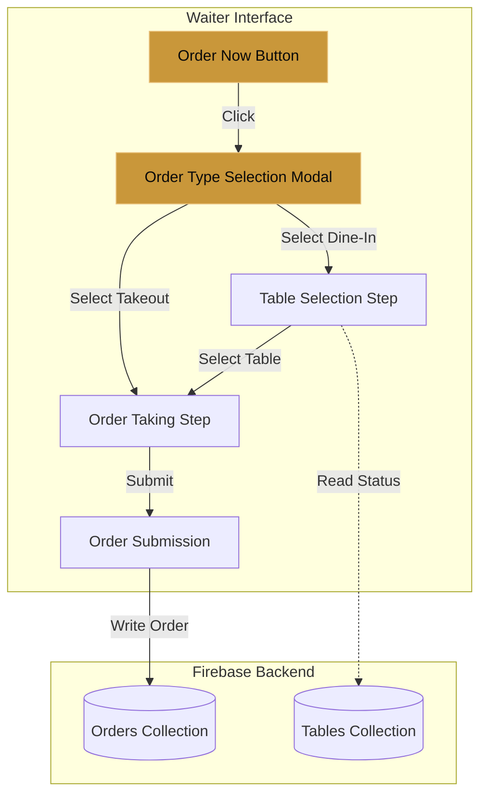
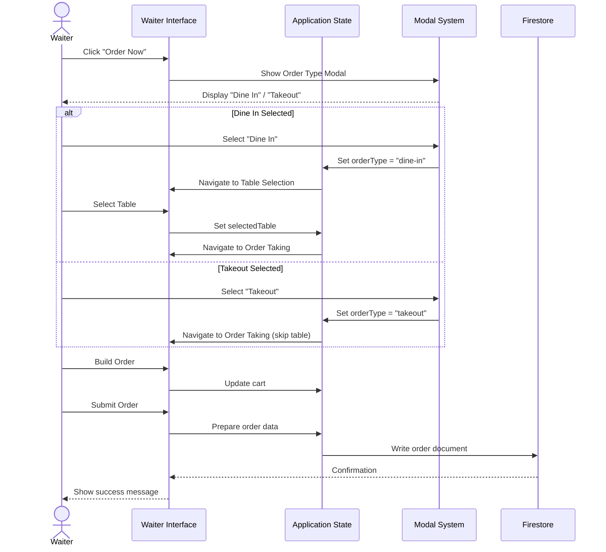

# Design Document: Dine-In and Takeout Order Flow

## Overview

This design introduces takeout ordering capability to the waiter interface by adding an order type selection modal at the workflow entry point. The feature modifies the existing table-first ordering flow to support two distinct paths:

- **Dine-in path**: Select table → Take order → Submit (existing flow)
- **Takeout path**: Take order → Submit (new flow, bypasses table selection)

The implementation leverages the existing waiter.js state management, modal system, and step navigation infrastructure. The primary changes involve:

1. Adding an "Order Now" button as the new entry point
2. Creating an order type selection modal
3. Modifying the step indicator to reflect the appropriate workflow
4. Storing order type in the cart/order session
5. Conditionally rendering table-related UI elements based on order type

The solution maintains visual consistency with the existing dark theme and gold accent system, using the established modal patterns and animation styles already present in the codebase.

## Architecture

### System Context



### Component Interaction Flow



## Components and Interfaces

### 1. Order Now Button Component

**Purpose**: Primary entry point for initiating any order workflow.

**Location**: Inserted at the beginning of `#stepTables`, replacing the immediate display of the table grid.

**HTML Structure**:
```html
<div class="order-entry-screen" id="orderEntry">
  <div class="order-entry-content">
    <div class="entry-icon">🍽️</div>
    <h2 class="entry-title">Ready to Take an Order?</h2>
    <p class="entry-subtitle">Choose your order type to begin</p>
    <button class="btn-order-now" id="orderNowBtn">
      <span>Order Now</span>
      <i class="fa-solid fa-arrow-right"></i>
    </button>
  </div>
</div>
```

**CSS Styling**:
- Full-height centered layout using flexbox
- Gold gradient button with hover effects matching existing button styles
- Fade-in animation on load
- Hidden after order type selection

**Behavior**:
- Displays on initial page load
- On click: triggers `showOrderTypeModal()`
- Hidden when returning from an order (keeps existing "back to tables" behavior)

### 2. Order Type Selection Modal

**Purpose**: Allows waiter to choose between dine-in and takeout order types.

**HTML Structure**:
```html
<div class="modal-overlay" id="orderTypeModal">
  <div class="modal">
    <div class="modal-strip"></div>
    <div class="modal-header">
      <span class="modal-title">Select Order Type</span>
      <button class="modal-close-btn" id="orderTypeModalClose">✕</button>
    </div>
    <div class="modal-body">
      <div class="order-type-options">
        <button class="order-type-btn" data-type="dine-in" id="selectDineIn">
          <div class="ot-icon">🍽️</div>
          <div class="ot-label">Dine In</div>
          <div class="ot-desc">Customer seated at table</div>
        </button>
        <button class="order-type-btn" data-type="takeout" id="selectTakeout">
          <div class="ot-icon">📦</div>
          <div class="ot-label">Takeout</div>
          <div class="ot-desc">Food to go</div>
        </button>
      </div>
    </div>
  </div>
</div>
```

**CSS Styling**:
- Follows existing modal pattern (`.modal-overlay`, `.modal`)
- Two large, tappable buttons arranged horizontally (or stacked on mobile)
- Hover effects with scale transform and border color change
- Icons and labels styled consistently with existing UI elements

**Behavior**:
- Displayed when "Order Now" button is clicked
- Close button returns to order entry screen
- Clicking "Dine In": calls `selectOrderType('dine-in')`
- Clicking "Takeout": calls `selectOrderType('takeout')`

### 3. State Management Extensions

**Current State Variables** (from waiter.js):
```javascript
let selectedTable = null;
let cart = {};
let waiterName = '';
let waiterId = '';
```

**New State Variables**:
```javascript
let currentOrderType = null;  // 'dine-in' | 'takeout' | null
```

**State Management Functions**:

```javascript
function selectOrderType(type) {
  currentOrderType = type;
  $('#orderTypeModal').classList.remove('show');
  
  if (type === 'dine-in') {
    // Show table selection
    $('#orderEntry').classList.add('hidden');
    $('#stepTables').classList.remove('hidden');
    pill1Active();
  } else if (type === 'takeout') {
    // Skip to order taking
    $('#orderEntry').classList.add('hidden');
    $('#stepTables').classList.add('hidden');
    goToOrderDirect();
  }
}

function goToOrderDirect() {
  // Navigate directly to order taking step for takeout
  selectedTable = null;  // Ensure no table is set
  $('#selectedTableLabel').textContent = 'Takeout Order';
  pill1Done();
  pill2Active();
  
  const so = $('#stepOrder');
  so.classList.add('visible');
  requestAnimationFrame(() => so.classList.add('in'));
  
  renderMenuGrid();
  setupCatScrollBtns();
}

function resetOrderFlow() {
  currentOrderType = null;
  selectedTable = null;
  cart = {};
  updateCart();
  
  // Return to entry screen
  $('#orderEntry').classList.remove('hidden');
  $('#stepTables').classList.add('hidden');
  $('#stepOrder').classList.remove('visible', 'in');
  
  pill1Active();
  pill2Reset();
  pill3Reset();
}
```

### 4. Step Indicator Modifications

**Current Implementation**:
- Fixed 3-step indicator: Select Table → Take Order → Submit

**New Dynamic Implementation**:
- Dine-in: Select Table → Take Order → Submit (3 steps)
- Takeout: Take Order → Submit (2 steps)

**Implementation Approach**:
```javascript
function updateStepIndicator() {
  const pills = $('#stepPills');
  
  if (currentOrderType === 'takeout') {
    // Hide table selection pill, show only 2 steps
    $('#pill1').style.display = 'none';
    $('#stepArrow1').style.display = 'none';  // First arrow
  } else {
    // Show all 3 steps for dine-in
    $('#pill1').style.display = 'flex';
    $('#stepArrow1').style.display = 'block';
  }
}
```

**HTML Modifications**:
Add IDs to step arrows for dynamic hiding:
```html
<span class="step-arrow" id="stepArrow1">›</span>
```

### 5. Order Submission Modifications

**Current `confirmOrderBtn.onclick` flow**:
1. Gather cart items
2. Create order object with `tableNumber: selectedTable`
3. Write to Firestore orders collection
4. Update table status

**Modified flow**:
```javascript
$('confirmOrderBtn').onclick = async () => {
  const btn = $('#confirmOrderBtn');
  btn.disabled = true;
  btn.classList.add('loading');
  
  const newItems = Object.values(cart);
  const note = $('#orderNote').value.trim();
  
  // Construct base order object
  const orderData = {
    items: newItems,
    waiterName,
    waiterId,
    status: 'pending',
    createdAt: serverTimestamp(),
    note: note || '',
    orderType: currentOrderType  // NEW FIELD
  };
  
  // Conditionally add table number for dine-in orders
  if (currentOrderType === 'dine-in' && selectedTable) {
    orderData.tableNumber = selectedTable;
  }
  
  try {
    await addDoc(collection(db, 'orders'), orderData);
    
    // Update table status only for dine-in
    if (currentOrderType === 'dine-in' && selectedTable) {
      const tableDoc = tablesData[selectedTable];
      if (tableDoc?.docId) {
        await updateDoc(doc(db, 'tables', tableDoc.docId), {
          status: 'occupied',
          waiterId,
          waiterName,
          lastUpdated: serverTimestamp()
        });
      }
    }
    
    // Show success and reset
    $('#confirmModal').classList.remove('show');
    showSuccessMessage();
    setTimeout(() => resetOrderFlow(), 2000);
    
  } catch(e) {
    console.error(e);
    showToast('❌ Failed to submit order. Please retry.');
  } finally {
    btn.disabled = false;
    btn.classList.remove('loading');
  }
};
```

### 6. Back Navigation Modifications

**Current behavior**: Back from order taking returns to table selection

**New behavior**:
```javascript
function goBackFromOrder() {
  if (currentOrderType === 'takeout') {
    // Return to order type selection
    $('#stepOrder').classList.remove('in');
    setTimeout(() => {
      $('#stepOrder').classList.remove('visible');
      $('#orderTypeModal').classList.add('show');
      currentOrderType = null;
    }, 400);
  } else {
    // Return to table selection (existing behavior)
    goBackToTables();
  }
}
```

### 7. Visual Differentiation Components

**Takeout Order Badge** (displayed in cart panel header):
```html
<div class="order-type-badge takeout-badge" id="orderTypeBadge">
  <i class="fa-solid fa-box"></i> Takeout Order
</div>
```

**CSS**:
```css
.order-type-badge {
  display: inline-flex;
  align-items: center;
  gap: 6px;
  font-size: 11px;
  font-weight: 700;
  letter-spacing: 0.1em;
  text-transform: uppercase;
  padding: 4px 10px;
  border-radius: 100px;
}

.takeout-badge {
  background: var(--orange-dim);
  color: var(--orange);
  border: 1px solid rgba(230,126,34,0.3);
}
```

**Confirmation Modal Updates**:
```javascript
// In order confirmation modal body generation
const orderTypeDisplay = currentOrderType === 'takeout' 
  ? '<div class="confirm-order-type">📦 Order Type: <strong>Takeout</strong></div>'
  : `<div class="confirm-order-type">🍽️ Table: <strong>${selectedTable}</strong></div>`;

$('confirmModalBody').innerHTML = orderTypeDisplay + /* existing items display */;
```

## Data Models

### Order Document Schema

**Firestore Collection**: `orders`

**Document Structure**:
```typescript
interface Order {
  // Existing fields
  id: string;                    // Auto-generated by Firestore
  items: OrderItem[];
  waiterName: string;
  waiterId: string;
  status: 'pending' | 'preparing' | 'served' | 'paid' | 'completed';
  createdAt: Timestamp;
  updatedAt?: Timestamp;
  note: string;
  
  // Modified fields
  tableNumber?: number;          // Optional: only present for dine-in orders
  
  // NEW fields
  orderType: 'dine-in' | 'takeout';  // Required: determines order workflow
}

interface OrderItem {
  id: string;
  name: string;
  price: number;
  qty: number;
  category: string;
}
```

**Field Rules**:
- `orderType`: Always required, set during order type selection
- `tableNumber`: 
  - Required and present when `orderType === 'dine-in'`
  - Omitted or null when `orderType === 'takeout'`
- Backend queries can filter by `orderType` for separate dine-in/takeout views

### Application State Model

```typescript
interface WaiterAppState {
  // Existing state
  waiterName: string;
  waiterId: string;
  menuItems: MenuItem[];
  cart: Record<string, CartItem>;
  selectedTable: number | null;
  activeCat: string;
  allOrders: Order[];
  tablesData: Record<number, TableData>;
  
  // NEW state
  currentOrderType: 'dine-in' | 'takeout' | null;
}
```

**State Lifecycle**:
1. **Initial**: `currentOrderType = null`, entry screen displayed
2. **Order Type Selected**: `currentOrderType = 'dine-in' | 'takeout'`
3. **Order Building**: State persists through order taking step
4. **Order Submitted**: Order document created with `orderType` field
5. **Reset**: `currentOrderType = null`, return to entry screen

## Error Handling

### Order Type Selection Errors

**Scenario**: Modal fails to display
- **Detection**: Check modal element existence
- **Handling**: Log error, show toast notification, fall back to direct table selection
- **User Impact**: Minimal – existing flow remains functional

**Scenario**: User closes modal without selection
- **Detection**: Modal close event without `currentOrderType` being set
- **Handling**: Return to entry screen, allow re-selection
- **User Impact**: None – can restart order flow

### Order Submission Errors

**Scenario**: Firestore write fails
- **Detection**: `try/catch` around `addDoc()` call
- **Handling**: 
  - Display error toast with retry instruction
  - Keep order data in cart
  - Re-enable submit button
  - Log error details to console
- **User Impact**: Order preserved, can retry submission

**Scenario**: Order submitted with missing `orderType`
- **Prevention**: Validate `currentOrderType` is set before submission
- **Handling**: 
  ```javascript
  if (!currentOrderType) {
    showToast('⚠️ Order type not set. Please restart order flow.');
    resetOrderFlow();
    return;
  }
  ```
- **User Impact**: Prevented from creating invalid orders

**Scenario**: Dine-in order submitted without table selection
- **Prevention**: Check `selectedTable` when `orderType === 'dine-in'`
- **Handling**:
  ```javascript
  if (currentOrderType === 'dine-in' && !selectedTable) {
    showToast('⚠️ Please select a table for dine-in orders.');
    goBackFromOrder();
    return;
  }
  ```
- **User Impact**: Guided back to correct workflow step

### State Consistency Errors

**Scenario**: Navigation occurs with inconsistent state
- **Detection**: Validate state before each navigation action
- **Handling**: 
  - Reset to known good state
  - Log inconsistency for debugging
  - Guide user back to entry screen
- **User Impact**: Order flow restarted from beginning

**Scenario**: Browser refresh during order taking
- **Current Behavior**: State is lost (no localStorage persistence in current implementation)
- **Proposed Handling**: 
  - Return user to entry screen
  - Consider future enhancement: persist order state to localStorage
- **User Impact**: Must restart order, but no data corruption

### UI State Errors

**Scenario**: Step indicator displays incorrectly
- **Detection**: Visual inspection or automated UI tests
- **Handling**: 
  - Call `updateStepIndicator()` after every state change
  - Ensure proper CSS classes are toggled
- **User Impact**: Potential confusion, but doesn't affect functionality

**Scenario**: Modal overlay remains visible after selection
- **Detection**: Check modal visibility state
- **Handling**: 
  - Explicitly remove 'show' class on all modal actions
  - Add cleanup in navigation functions
- **User Impact**: UI blockage, resolved by explicit modal close

## Testing Strategy

This feature is primarily UI-focused with modal interactions, DOM manipulation, and workflow navigation. Property-based testing is not applicable for the following reasons:

1. **UI Rendering and Layout**: The feature involves displaying modals, buttons, and dynamic step indicators—visual elements that don't have universal properties across varied inputs
2. **State Machine Transitions**: Navigation between steps is deterministic based on user clicks, not input variation
3. **DOM Manipulation**: Testing involves verifying elements are shown/hidden, not pure function behavior
4. **Integration with Firebase**: Order submission involves external service calls, best tested with mocks and integration tests

### Manual Testing Checklist

#### Order Now Button & Entry Flow
- [ ] "Order Now" button displays prominently on initial page load
- [ ] Clicking "Order Now" opens Order Type Selection Modal
- [ ] Modal displays both "Dine In" and "Takeout" options
- [ ] Modal close button returns to entry screen without selecting order type

#### Dine-In Order Flow
- [ ] Selecting "Dine In" closes modal and shows table selection
- [ ] Step indicator shows: Select Table → Take Order → Submit
- [ ] Table can be selected from available tables
- [ ] Order taking step displays table number in header
- [ ] Cart panel shows table number, not "Takeout" badge
- [ ] Back button from order taking returns to table selection
- [ ] Order confirmation modal shows table number
- [ ] Submitted order includes `orderType: "dine-in"` and `tableNumber`
- [ ] Table status updates to "occupied" after order submission
- [ ] Success message displays correctly

#### Takeout Order Flow
- [ ] Selecting "Takeout" closes modal and skips table selection
- [ ] Step indicator shows: Take Order → Submit (no table selection step)
- [ ] Order taking step displays "Takeout Order" label in header
- [ ] Cart panel displays "Takeout Order" badge
- [ ] Back button from order taking returns to order type selection modal
- [ ] Order confirmation modal shows "Order Type: Takeout"
- [ ] Submitted order includes `orderType: "takeout"` and no `tableNumber` field
- [ ] No table status updates occur after order submission
- [ ] Success message displays correctly

#### Navigation & State Management
- [ ] Order type persists throughout order building process
- [ ] Clearing cart doesn't reset order type
- [ ] Completing order resets state and returns to entry screen
- [ ] Canceling from confirmation modal keeps order type and returns to order taking
- [ ] Multiple orders can be taken in sequence (alternating dine-in/takeout)

#### Visual Differentiation
- [ ] Takeout orders show distinct orange "Takeout Order" badge
- [ ] Dine-in orders show table number in gold styling
- [ ] Step indicator pills hide/show correctly based on order type
- [ ] Modal animations work smoothly
- [ ] Button hover states provide clear feedback

#### Error Handling
- [ ] Submitting dine-in order without table shows error toast
- [ ] Submitting order without order type shows error toast
- [ ] Failed order submission keeps order data in cart for retry
- [ ] Browser refresh returns user to entry screen safely
- [ ] Navigation with invalid state resets to entry screen

#### Responsive Behavior
- [ ] Order type modal displays correctly on mobile devices
- [ ] Order type buttons are easily tappable on touch screens
- [ ] Step indicator adapts to smaller screens
- [ ] All text remains readable across viewport sizes

### Unit Test Coverage (Example-Based)

**Test Suite: Order Type Selection**
```javascript
describe('Order Type Selection', () => {
  test('should display order type modal when Order Now is clicked', () => {
    clickOrderNowButton();
    expect(orderTypeModal).toBeVisible();
  });
  
  test('should set orderType to "dine-in" when Dine In is selected', () => {
    selectOrderType('dine-in');
    expect(currentOrderType).toBe('dine-in');
  });
  
  test('should set orderType to "takeout" when Takeout is selected', () => {
    selectOrderType('takeout');
    expect(currentOrderType).toBe('takeout');
  });
  
  test('should navigate to table selection after selecting dine-in', () => {
    selectOrderType('dine-in');
    expect(tableSelectionStep).toBeVisible();
  });
  
  test('should skip table selection after selecting takeout', () => {
    selectOrderType('takeout');
    expect(orderTakingStep).toBeVisible();
    expect(tableSelectionStep).not.toBeVisible();
  });
});
```

**Test Suite: Order Submission**
```javascript
describe('Order Submission with Order Types', () => {
  test('should include orderType field in dine-in orders', async () => {
    setupDineInOrder(tableNumber: 5);
    await submitOrder();
    expect(submittedOrder).toHaveProperty('orderType', 'dine-in');
    expect(submittedOrder).toHaveProperty('tableNumber', 5);
  });
  
  test('should include orderType field in takeout orders', async () => {
    setupTakeoutOrder();
    await submitOrder();
    expect(submittedOrder).toHaveProperty('orderType', 'takeout');
  });
  
  test('should omit tableNumber field in takeout orders', async () => {
    setupTakeoutOrder();
    await submitOrder();
    expect(submittedOrder).not.toHaveProperty('tableNumber');
  });
  
  test('should prevent dine-in submission without table selection', async () => {
    setupDineInOrder(tableNumber: null);
    await submitOrder();
    expect(errorToast).toBeVisible();
    expect(submittedOrder).toBeNull();
  });
});
```

**Test Suite: State Management**
```javascript
describe('Order Flow State Management', () => {
  test('should reset currentOrderType after successful order submission', async () => {
    setupTakeoutOrder();
    await submitOrder();
    expect(currentOrderType).toBeNull();
  });
  
  test('should preserve orderType when returning from confirmation modal', () => {
    setupTakeoutOrder();
    openConfirmationModal();
    cancelConfirmation();
    expect(currentOrderType).toBe('takeout');
  });
  
  test('should clear cart and orderType when resetOrderFlow is called', () => {
    setupTakeoutOrder();
    addItemsToCart();
    resetOrderFlow();
    expect(cart).toEqual({});
    expect(currentOrderType).toBeNull();
  });
});
```

**Test Suite: UI Updates**
```javascript
describe('Dynamic UI Updates', () => {
  test('should hide table selection pill for takeout orders', () => {
    selectOrderType('takeout');
    updateStepIndicator();
    expect(pill1).not.toBeVisible();
  });
  
  test('should display all pills for dine-in orders', () => {
    selectOrderType('dine-in');
    updateStepIndicator();
    expect(pill1).toBeVisible();
    expect(pill2).toBeVisible();
    expect(pill3).toBeVisible();
  });
  
  test('should display "Takeout Order" label for takeout orders', () => {
    goToOrderDirect();
    expect(selectedTableLabel).toHaveTextContent('Takeout Order');
  });
  
  test('should display table number for dine-in orders', () => {
    goToOrder(tableNumber: 7);
    expect(selectedTableLabel).toHaveTextContent('Table 7');
  });
});
```

### Integration Test Scenarios

**Scenario: End-to-End Dine-In Order**
1. Load waiter interface
2. Click "Order Now" button
3. Select "Dine In" from modal
4. Select table #3
5. Add 2 items to cart
6. Submit order
7. Verify order document in Firestore contains:
   - `orderType: "dine-in"`
   - `tableNumber: 3`
   - 2 items
8. Verify table #3 status updated to "occupied"
9. Verify success message displayed
10. Verify return to entry screen

**Scenario: End-to-End Takeout Order**
1. Load waiter interface
2. Click "Order Now" button
3. Select "Takeout" from modal
4. Add 3 items to cart
5. Submit order
6. Verify order document in Firestore contains:
   - `orderType: "takeout"`
   - No `tableNumber` field
   - 3 items
7. Verify no table status changes
8. Verify success message displayed
9. Verify return to entry screen

**Scenario: Mixed Order Sequence**
1. Complete one dine-in order (table #1)
2. Complete one takeout order
3. Complete another dine-in order (table #2)
4. Verify all three orders have correct `orderType` values
5. Verify only dine-in orders have table numbers
6. Verify only tables #1 and #2 are marked occupied

### Browser Compatibility Testing

Test on:
- Chrome/Edge (Chromium)
- Firefox
- Safari (macOS/iOS)
- Mobile browsers (Chrome Mobile, Safari Mobile)

Focus areas:
- Modal display and animations
- Touch interactions on mobile
- CSS flexbox layout behavior
- Firebase API compatibility

