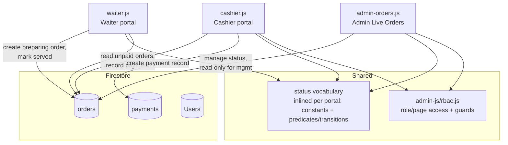
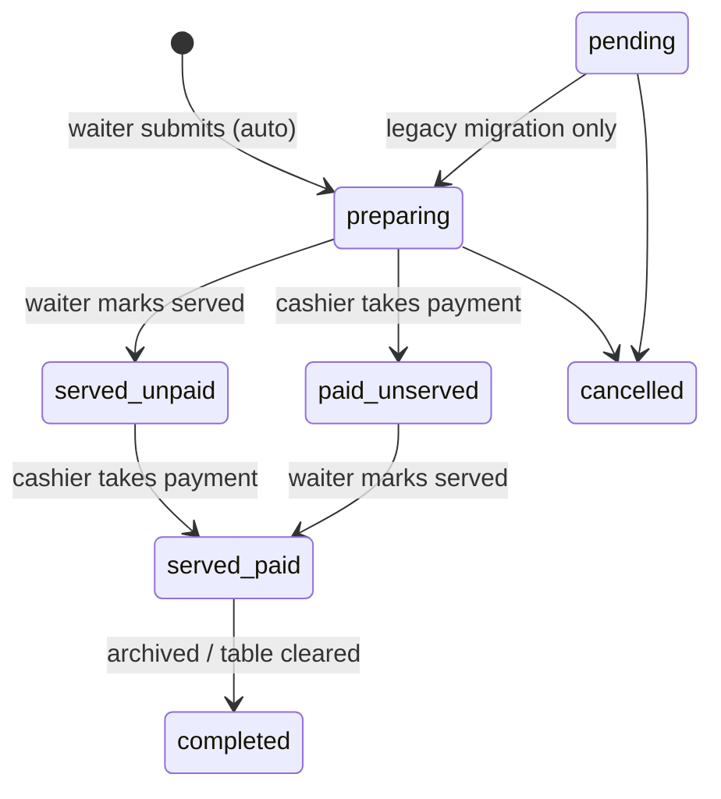

# Design Document

## Overview

This feature reworks the end-to-end order flow of the Salo sa Antipolo system so that
preparation, serving, and payment behave as intended across the Waiter, Cashier, and
Admin portals. It is a rework of the existing `dine-in-takeout-order-flow` and reuses
its established patterns (`escapeHtml`, `rbac.js` guards, the toast pattern, and the
shared financial constants VAT 12%, service charge 7%, Senior/PWD 20%).

The rework standardizes four behaviors:

1. **Automatic preparation** — a submitted order is created with status `preparing`
   instead of `pending`; the manual admin "Start Preparing" step is removed from the
   normal flow (retained only as a migration control for legacy `pending` orders).
2. **Independent preparation and payment** — an order is only *Complete* when it is
   both **paid** and **served**. The two axes advance independently and combine into a
   single `status` field.
3. **Full cashier visibility** — the Cashier portal shows *every* unpaid order until it
   is paid, regardless of preparation or serving progress. This fixes the current bug
   where the cashier only sees `status === 'pending'`, so orders vanish the moment they
   move to `preparing` or are served.
4. **Single cashier experience** — the dedicated Cashier portal (`cashier.html`) becomes
   the only place payments are processed; the limited embedded Admin cashier view is
   removed.

It also adds a **Waiter order-slip panel** on the right of the Waiter portal so waiters
can review their active orders and mark them served from a clickable slip.

### Root cause analysis

The current defects trace to a **fragmented status vocabulary**. The Admin page
(`admin-orders.js`) already uses the full model (`preparing`, `served_unpaid`,
`paid_unserved`, `served_paid`, `completed`, `cancelled`), but:

- `waiter.js` still creates orders as `pending` and its table rendering keys off legacy
  `'served'` / `'paid'` values that no longer exist.
- `cashier.js` filters its queue and badge on the single literal `'pending'`, so any
  order past that state disappears from the cashier queue even though it is unpaid.

The design's central remedy is a **single, consistent status vocabulary** applied across
the portals. Because the project is intentionally per-page and self-contained (no shared
modules beyond `rbac.js`), each portal carries its own small copy of the status constants
and the predicates that classify orders (paid? served? unpaid? complete?), using
identical status strings so the portals agree.

## Architecture

### Portals and shared code



All three portals subscribe to the `orders` collection via `onSnapshot` ordered by
`createdAt desc` (existing pattern) and re-render reactively. The rework changes **what
each portal filters and writes**, not the transport.

### The status model

Preparation progress and payment are independent axes that combine into one `status`
field:



Recognized `status` values: `preparing`, `served_unpaid`, `paid_unserved`,
`served_paid`, `completed`, `cancelled`. The legacy value `pending` is recognized only
for backward compatibility with pre-existing orders.

Derived classifications (defined once in `order-status.js`):

| Classification | Definition |
| --- | --- |
| **Paid_Order** | status ∈ { `paid_unserved`, `served_paid`, `completed` } |
| **Served_Order** | status ∈ { `served_unpaid`, `served_paid` } **or** a truthy `servedAt` |
| **Unpaid_Order** | not a Paid_Order and status ≠ `cancelled` (i.e. `preparing`, `served_unpaid`, or legacy `pending`) |
| **Complete_Order** | a Paid_Order **and** a Served_Order (represented as `served_paid`) |

### Status logic (inlined per portal)

Rather than a shared module, each portal (`waiter.js`, `cashier.js`, `admin-orders.js`)
inlines the small set of status constants and pure predicates it needs, using identical
status strings so the portals stay in agreement. Inlined copies use plain `const` (no
`export`) and each portal includes only the subset it uses. The reference shape they
draw from is:

```js
// order-status.js — single source of truth for the order status model
export const STATUS = Object.freeze({
  PENDING: 'pending',            // legacy only
  PREPARING: 'preparing',
  SERVED_UNPAID: 'served_unpaid',
  PAID_UNSERVED: 'paid_unserved',
  SERVED_PAID: 'served_paid',
  COMPLETED: 'completed',
  CANCELLED: 'cancelled',
});

export const RECOGNIZED_STATUSES = [ /* all values above */ ];
export const PAID_STATUSES   = ['paid_unserved', 'served_paid', 'completed'];
export const SERVED_STATUSES = ['served_unpaid', 'served_paid'];

export const isRecognized = (s) => RECOGNIZED_STATUSES.includes(s);
export const isPaid       = (o) => PAID_STATUSES.includes(o?.status);
export const isServed     = (o) => SERVED_STATUSES.includes(o?.status) || !!o?.servedAt;
export const isCancelled  = (o) => o?.status === 'cancelled';
export const isUnpaid     = (o) => !isPaid(o) && !isCancelled(o);
export const isComplete   = (o) => isPaid(o) && isServed(o);

// Payment outcome: takeout needs no serving step, so paying completes it;
// dine-in served orders become served_paid, otherwise paid_unserved.
export const nextStatusAfterPayment = (o) =>
  (o?.orderType === 'takeout' || !o?.tableNumber) ? STATUS.COMPLETED
    : isServed(o) ? STATUS.SERVED_PAID
    : STATUS.PAID_UNSERVED;

// Serving outcome: paid orders become served_paid, otherwise served_unpaid.
// Never returns 'completed' for an unpaid order (Req 8.5).
export const nextStatusAfterServed = (o) =>
  isPaid(o) ? STATUS.SERVED_PAID : STATUS.SERVED_UNPAID;

// Guards
export const canFinalizePayment    = (o) => isUnpaid(o);            // Req 4.5/4.6
export const belongsInCashierQueue = (o) => isUnpaid(o);           // Req 3
export const shouldShowServedButton = (o) =>
  !isServed(o) && o?.status !== 'completed' && o?.status !== 'cancelled'; // Req 7.1/7.5
export const belongsInWaiterSlips = (o, waiterId) =>
  o?.waiterId === waiterId && !isServed(o) &&
  o?.status !== 'completed' && o?.status !== 'cancelled';           // Req 6.2

// Admin grouping: recognized status name, or the 'unrecognized' bucket (never hidden).
export const adminGroupOf = (o) => isRecognized(o?.status) ? o.status : 'unrecognized';
```

The financial calculation (`calculateFinancials`) already exists per portal in
`cashier.js` and `admin-orders.js`. To satisfy Req 9.5 without a risky rewrite, the
design keeps these per-portal copies as-is; they share identical constants (VAT 12%,
service charge 7%, Senior/PWD 20%) and identical math, so every portal computes the same
amounts for identical inputs.

## Components and Interfaces

### 1. Waiter portal (`waiter.js` / `waiter.html` / `waiter.css`)

**Order submission (Req 1).** The order document builder is changed to write
`status: STATUS.PREPARING` for brand-new orders (currently `'pending'` at the
`orderData` literal). The existing re-order merge path already writes `preparing`, so it
is unchanged. A pure helper makes this testable:

```js
// buildOrderDocument(cart, { orderType, waiterId, waiterName }) -> order doc (sans server timestamps)
// - status: 'preparing'
// - waiterName, waiterId, orderType, items, total present
// - tableNumber = selectedTable for dine-in, null for takeout
// createdAt/updatedAt are attached at write time via serverTimestamp()
```

**Order-slip panel (Req 6).** A new panel (`#orderSlipPanel`) is added to the right side
of the waiter interface. It renders from the existing `allOrders` snapshot, filtered by
`belongsInWaiterSlips(order, waiterId)`. Because it derives from the live snapshot, new
orders (6.3) and status changes (6.4) update automatically on the next `onSnapshot`
callback. Each slip shows order id, location (`Table N` / `Takeout`), status label, and
item count; all order-derived text is passed through `escapeHtml` before injection
(6.6). Selecting a slip sets a `selectedSlipOrderId` and renders a detail view (6.5). The detail
view also offers a **Print Order Slip** control (`window._printSlip`) that opens a
kitchen-copy print window (location, waiter, time, and items/quantities — no prices),
mirroring the cashier portal's `printOrderSlip` format; the browser print dialog's "Save
as PDF" exports it as a PDF (6.7).

**Served action (Req 7).** When a slip is selected and `shouldShowServedButton(order)`
is true, the detail view renders a **Served** button. Activating it computes
`nextStatusAfterServed(order)` and writes:

```js
await updateDoc(doc(db, 'orders', id), {
  status: nextStatusAfterServed(order),          // served_unpaid or served_paid
  ...(order.servedAt ? {} : { servedAt: serverTimestamp() }), // first-write-wins (Req 9.4)
  updatedAt: serverTimestamp(),
});
```

Already-served orders omit the button (7.5). An unpaid order marked served becomes
`served_unpaid`, never `completed` (8.5).

**Status vocabulary cleanup (Req 9).** `calculateMenuOrderCounts` and `renderTables`
currently reference the removed `'served'` / `'paid'` literals. These are updated to the
shared predicates: a table is occupied while its order `isUnpaid`, and the "served"
visual state uses `isServed`. This keeps table tiles consistent with the new model.

### 2. Cashier portal (`cashier.js` / `cashier.html`)

**Queue + badge visibility (Req 3).** `renderOrders` and `updateOrdersBadge` replace the
`o.status === 'pending'` filter with `belongsInCashierQueue(o)` (i.e. `isUnpaid(o)`).
The badge counts exactly the orders in the rendered list (3.5). Cancelled and already
paid orders are excluded by the predicate.

**Payment outcome (Req 4).** `processPayment` changes in two ways:

- The stale-selection guard changes from `liveOrder.status !== 'pending'` to
  `!canFinalizePayment(liveOrder)`. Payment is re-checked against the live snapshot
  immediately before finalizing (4.5); if the order is no longer unpaid the attempt is
  cancelled and the cashier is notified via toast (4.6).
- The target status changes from the hardcoded `'paid_unserved'` to
  `nextStatusAfterPayment(liveOrder)`: a takeout order is completed on payment
  (`completed`, since takeout needs no serving step — Req 4.7 / 8.6); a dine-in
  `served_unpaid` order yields `served_paid` (4.1) while a dine-in unserved order
  yields `paid_unserved` (4.2).
- `paidAt` is written first-write-wins (9.3); a payment record is created in `payments`
  with cashier identity, order id, and collected amounts (4.3, 4.4) — the existing
  `paymentData` shape already covers this.

The read-only Billing view is a single-day ledger: it lists only today's non-`cancelled`
orders (an order belongs to today if it was paid today, or — for unpaid/legacy orders —
created today). Its status column intentionally collapses the serving distinction into
three
clearly-colored states — **Completed** (green: `completed`, and any paid takeout order,
since takeout is done once paid — this also covers legacy takeout orders paid before
auto-completion), **Paid** (any other `isPaid` order, gold), and **Not Paid** (unpaid
orders, red) — so the served/unserved split is not surfaced in Billing. **Today's Total
Revenue** sums the grand totals of orders *paid today*, keyed off `paidAt` (falling back
to `createdAt` for legacy orders) and bounded strictly to the current day, computed over
the whole ledger so the search box never changes the figure.

### 3. Admin Live Orders (`admin-orders.js`)

**Start Preparing scoping (Req 2).** The Admin page already models the full status set
and groups unrecognized statuses. The only change: because new orders now arrive as
`preparing`, the `pending` → `preparing` action in `STATUS_ACTIONS` now applies **only**
to legacy `pending` orders (2.3). No normal-flow card renders a Start Preparing control
(2.1). The `preparing → served_unpaid` and `preparing → paid_unserved` transitions are
preserved (2.4). The "Unrecognized Status" grouping and diagnostic logging already
satisfy 9.2 and 9.6; the diagnostic `console.warn` is confirmed/added for stray
statuses.

### 4. Access control (`admin-js/rbac.js`) — Single cashier experience (Req 5)

The cashier-designated role in the running system is `admin_cashier`: `cashier-login.js`
authenticates **only** `admin_cashier` (rejecting and signing out any other role) and
sets a `useCashierInterface` sessionStorage flag, and `guardCashierPage` admits **only**
`admin_cashier` before routing to `cashier.html`. The "Embedded Admin cashier view" is
therefore composed of two concrete mechanisms:

1. `admin_cashier`'s `ROLE_PAGES` / `NAV_ITEMS` entries in `rbac.js` that grant it
   access to `admin-overview.html`, `admin-orders.html`, and `admin-billing.html`.
2. A special-case branch in `guardAdminPage` that lets `admin_cashier` combined with the
   `useCashierInterface` flag pass into those admin pages instead of being redirected out.

To remove the embedded view (5.1) while preserving management visibility (5.4), the design
makes the following concrete changes:

- **Reduce `admin_cashier` access to the cashier portal only.** Remove the
  `admin-overview.html`, `admin-orders.html`, and `admin-billing.html` entries from
  `admin_cashier`'s `ROLE_PAGES`, and remove its `NAV_ITEMS` entries
  (`['overview','orders','billing']`) so it can no longer navigate any embedded Admin
  cashier page.
- **Remove the `useCashierInterface` flag mechanism** (set in `cashier-login.js`) and the
  special `admin_cashier` branch in `guardAdminPage` that consults that flag to admit
  `admin_cashier` into admin pages. With both gone, `admin_cashier` is no longer treated
  as an admin-tier role for page access.
- **Keep `guardCashierPage` admitting `admin_cashier`** and routing it to `cashier.html`,
  which is unchanged and continues to satisfy 5.2 and 5.3.
- **Preserve admin management access.** `admin_manager`, `admin_owner`, and legacy `admin`
  retain their existing `ROLE_PAGES` / `NAV_ITEMS` access to Admin Orders and Billing for
  read/oversight (5.4). These roles are untouched by the change.

> **Design decision (Option A — keep `admin_cashier`, no consolidation):** the cashier
> login and `guardCashierPage` are already wired to `admin_cashier`, so this design keeps
> `admin_cashier` as the cashier role and simply strips its embedded Admin Orders/Billing
> access (its extra `ROLE_PAGES` / `NAV_ITEMS` entries plus the `useCashierInterface`
> guard branch). The standalone `cashier` role is fully defined in `rbac.js` (`ROLE_PAGES`,
> `DEFAULT_PAGE`, `ROLE_LABEL`, `ROLE_BADGE_COLOR`, `isCashierRole`, `CASHIER_PERMISSIONS`)
> but is dead/unused — neither `cashier-login.js` nor `guardCashierPage` accept it, so it
> remains unused config and is left in place. Role consolidation (migrating
> `admin_cashier` → `cashier`, updating Firestore rules) is explicitly **out of scope**,
> avoiding any change to existing accounts or a data migration.

## Data Models

### Order document (`orders/{id}`)

| Field | Type | Notes |
| --- | --- | --- |
| `status` | string | One of the recognized values; legacy `pending` tolerated. |
| `orderType` | string | `'dine-in'` or `'takeout'`. |
| `tableNumber` | number \| null | Set for dine-in; `null` for takeout (Req 1.4/1.5). |
| `waiterId` | string | Firebase UID of the submitting waiter. |
| `waiterName` | string | Display name. |
| `items` | array | `{ id, name, qty, price }` entries. |
| `total` | number | Pre-tax sum of item price × qty. |
| `note` | string | Optional. |
| `discountType` | string | `'none' \| 'senior' \| 'pwd'`. |
| `createdAt` | Timestamp | Set on creation (Req 1.2). |
| `updatedAt` | Timestamp | Set on every write (Req 1.2). |
| `paidAt` | Timestamp | First-write-wins when payment recorded (Req 9.3). |
| `servedAt` | Timestamp | First-write-wins when served recorded (Req 9.4). |
| `paidBy`, `paymentMethod`, `grandTotal`, `cashTendered`, `changeGiven` | mixed | Written by cashier at payment. |
| `newItems` | array | Existing re-order announcement; unchanged. |

### Payment record (`payments/{id}`) — unchanged shape

Contains `orderId`, `tableNumber`, `waiterName`, `cashierId`, `cashierName`,
`paymentMethod`, `discountType`, `discountAmount`, `subtotal`, `vatAmount`, `vatExempt`,
`serviceCharge`, `grandTotal`, `cashTendered`, `changeGiven`, `timestamp` (Req 4.4).

### Financial constants (shared, Req 9.5)

`VAT_RATE = 0.12`, `SERVICE_CHARGE_RATE = 0.07`, `SENIOR_DISCOUNT_RATE = 0.20`,
`PWD_DISCOUNT_RATE = 0.20`. VAT is extracted from a VAT-inclusive price
(`vat = afterDiscount × 0.12 / 1.12`); Senior/PWD are VAT-exempt; service charge applies
to the after-discount amount. This mirrors the existing `calculateFinancials` in both
`cashier.js` and `admin-orders.js`, now sourced from one implementation.

## Correctness Properties

*A property is a characteristic or behavior that should hold true across all valid
executions of a system — essentially, a formal statement about what the system should
do. Properties serve as the bridge between human-readable specifications and
machine-verifiable correctness guarantees.*

The status logic inlined in each portal (predicates, transitions, and the order and
payment document builders) captures the feature's correctness: each function takes an
order-like value and returns a classification, a next status, or a structured document.
The properties below are stated as behavioral specifications and are checked by the
manual verification pass rather than by automated tests.

### Property 1: Submitted orders are well-formed and start preparing

*For any* cart of items, order type, and waiter identity, the order document produced at
submission has status `preparing`, includes the waiter name, waiter id, order type, item
list, and computed total, designates `createdAt` and `updatedAt` for writing, and sets
`tableNumber` to the selected table when the order type is `dine-in` and to `null` when
it is `takeout`.

**Validates: Requirements 1.1, 1.2, 1.3, 1.4, 1.5**

### Property 2: The cashier queue contains exactly the unpaid orders

*For any* order, it belongs in the Cashier_Pending_List if and only if it is an
Unpaid_Order — that is, it is not paid (`paid_unserved`, `served_paid`, or `completed`)
and not `cancelled`. This holds for `preparing`, `served_unpaid`, and legacy `pending`
orders (included) and for paid and cancelled orders (excluded).

**Validates: Requirements 3.1, 3.2, 3.3, 3.4**

### Property 3: The pending badge count matches the pending list

*For any* set of orders, the cashier pending-payment badge count equals the number of
orders that belong in the Cashier_Pending_List.

**Validates: Requirements 3.5**

### Property 4: Payment outcome depends on order type and prior serving

*For any* Unpaid_Order, processing payment yields status `completed` when the order is
takeout (no serving step required); otherwise, for a dine-in order, it yields
`served_paid` when the order is already a Served_Order and `paid_unserved` otherwise.

**Validates: Requirements 4.1, 4.2, 4.7, 8.2, 8.4, 8.6**

### Property 5: The payment finalize guard admits exactly unpaid orders

*For any* order, the payment attempt may be finalized if and only if the order is an
Unpaid_Order at the moment of the check; any order that is no longer unpaid is rejected.

**Validates: Requirements 4.5, 4.6**

### Property 6: Payment records carry cashier, order, and amount data

*For any* order, cashier identity, and computed financials, the payment record built for
the `payments` collection includes the cashier identity, the order identifier, and the
collected amounts, and the accompanying order update designates `paidAt` for writing.

**Validates: Requirements 4.3, 4.4**

### Property 7: Serving outcome depends on prior payment

*For any* order marked served, the resulting status is `served_paid` when the order is
already a Paid_Order and `served_unpaid` otherwise; an Unpaid_Order marked served is
never classified as `served_paid` or `completed`.

**Validates: Requirements 7.2, 7.3, 8.3, 8.5**

### Property 8: The Served button appears exactly for not-yet-served active orders

*For any* selected order, the Served_Button is offered if and only if the order is not a
Served_Order and is not `completed` or `cancelled` — i.e. a `preparing`/legacy `pending`
or `paid_unserved` order.

**Validates: Requirements 7.1, 7.5**

### Property 9: Completion requires both paid and served

*For any* order, it is a Complete_Order if and only if it is both a Paid_Order and a
Served_Order.

**Validates: Requirements 8.1**

### Property 10: Payment and serving timestamps are first-write-wins

*For any* order, recording payment sets `paidAt` only when no `paidAt` already exists,
and recording serving sets `servedAt` only when no `servedAt` already exists; an existing
timestamp is never overwritten.

**Validates: Requirements 9.3, 9.4**

### Property 11: The waiter order-slip panel lists exactly the waiter's unserved active orders

*For any* set of orders and a signed-in waiter, an order appears as a slip if and only if
it belongs to that waiter, is not yet served (not `served_unpaid` or `served_paid` and no
`servedAt`), and its status is neither `completed` nor `cancelled`. In practice the panel
shows only `preparing`/legacy `pending` and `paid_unserved` orders.

**Validates: Requirements 6.2, 6.3**

### Property 12: Order-derived text is escaped before rendering

*For any* order-derived string, the text injected into the order-slip panel is HTML-escaped
so that `&`, `<`, and `>` never appear unescaped in the rendered markup.

**Validates: Requirements 6.6**

### Property 13: Unrecognized statuses are grouped, never hidden

*For any* order whose status is outside the recognized set, the Admin_Live_Orders grouping
assigns it to the "Unrecognized Status" bucket rather than excluding it; orders with a
recognized status map to their own status group.

**Validates: Requirements 9.2**

### Property 14: Payable amounts follow the shared financial constants

*For any* order total and discount type, the computed financials satisfy: the grand total
equals the after-discount amount plus a 7% service charge; VAT is extracted at 12% of the
VAT-inclusive after-discount amount when not exempt; Senior and PWD apply a 20% discount
and mark the order VAT-exempt; and every portal's calculation produces identical amounts
for identical inputs.

**Validates: Requirements 9.5**

## Error Handling

- **Stale payment selection (Req 4.5/4.6).** Before finalizing, the cashier re-reads the
  order from the live snapshot and checks `canFinalizePayment`. If the order is no longer
  unpaid (already paid or cancelled by someone else), the payment is aborted, the
  selection is cleared, and a toast informs the cashier the order is no longer awaiting
  payment. This preserves the existing guard behavior, generalized from the single
  `'pending'` literal to the full unpaid set.
- **Unrecognized status (Req 9.2/9.6).** Any order whose status is outside the recognized
  set is rendered under the "Unrecognized Status" group in Admin Live Orders and a
  diagnostic `console.warn` identifies the affected order id and status. Orders are never
  silently hidden.
- **Missing / malformed order fields.** Predicates in `order-status.js` use optional
  chaining and treat a missing status as unrecognized (so it surfaces in the Admin
  unrecognized group rather than being classified as unpaid or paid). Rendering falls back
  to safe placeholders (`Table ?`, `Unknown`) as the current code already does.
- **Firestore write failures.** Existing `try/catch` around `updateDoc` / `addDoc` is
  retained; failures surface a toast (e.g. permission-denied, not-found) and leave the UI
  in a retryable state. No partial status change is presented as success.
- **First-write-wins timestamps.** `paidAt` / `servedAt` are only written when absent, so
  a re-submitted action or a race does not rewrite the original event time.

## Testing Strategy

This project keeps its no-build, no-npm vanilla setup: there is no `package.json`, test
runner, or `node_modules`, and there are no automated tests. Correctness is validated by
manual verification against the live Firebase app. The correctness properties above serve
as the behavioral checklist for that manual pass.

### Manual verification

Because the app runs against the live Firebase project with no emulator, an end-to-end
smoke pass is done manually: submit a waiter order (confirm it appears in the cashier
queue while preparing), mark it served from the waiter slip, take payment, and confirm it
lands as `served_paid` in Billing and disappears from the cashier queue.
